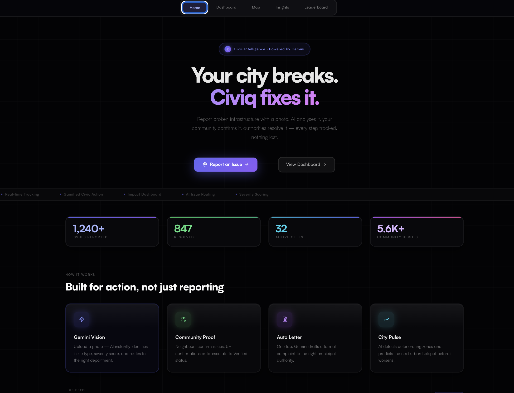
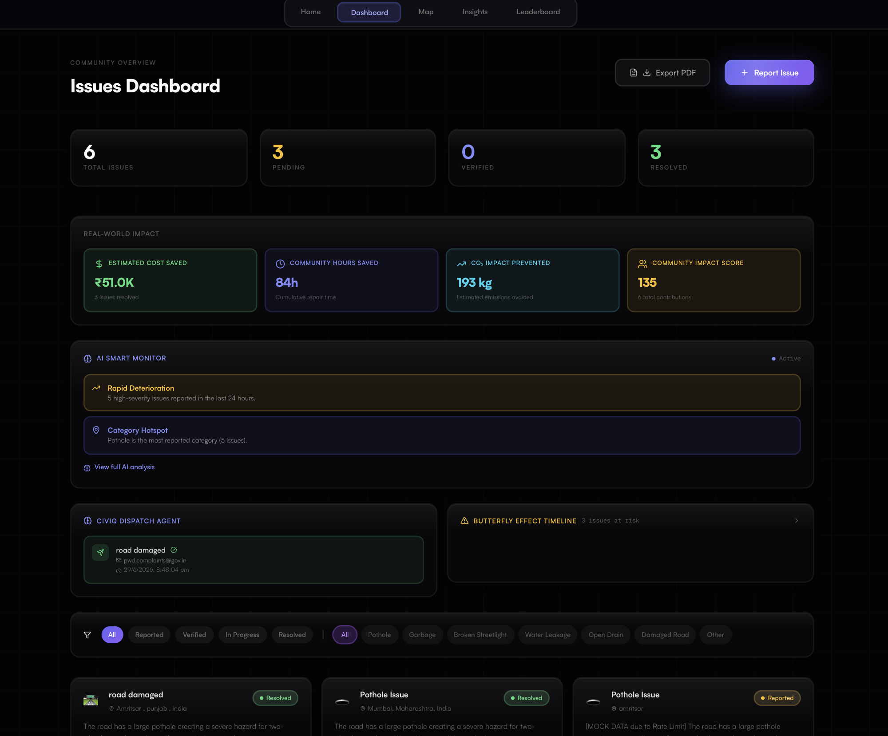
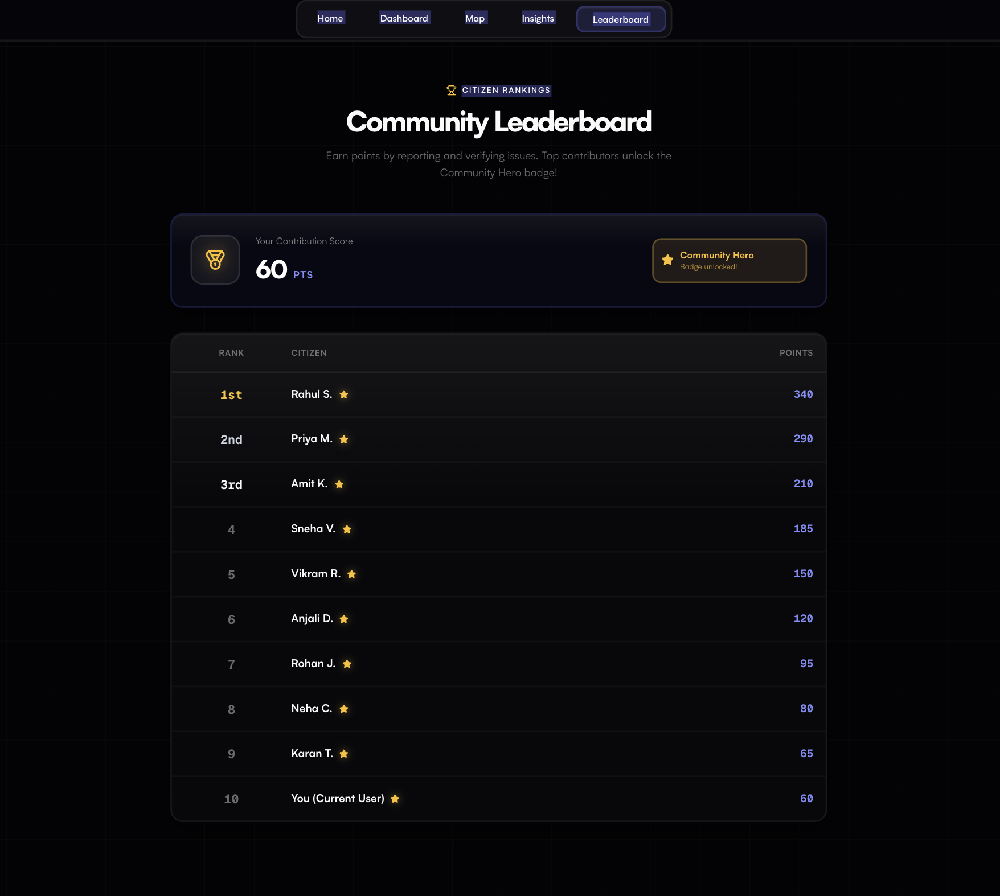
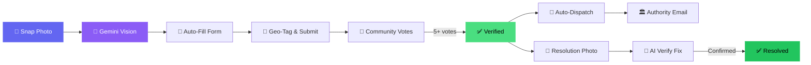
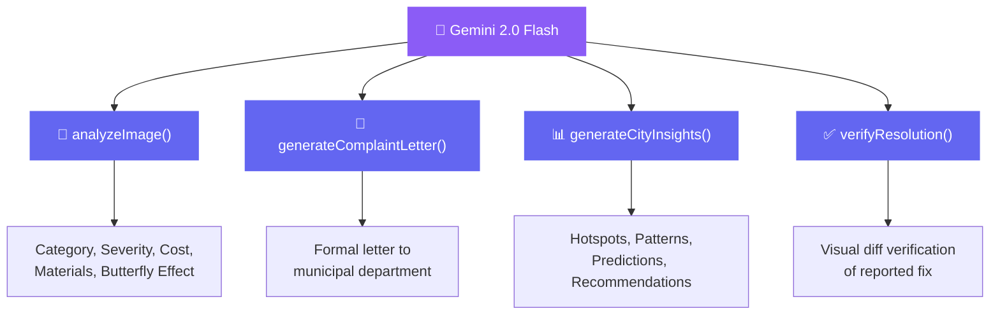

<div align="center">

<!-- ── ASCII LOGO ── -->

```
 ██████╗ ██╗ ██╗   ██╗ ██╗  ██████╗ 
██╔════╝ ██║ ██║   ██║ ██║ ██╔═══██╗
██║      ██║ ██║   ██║ ██║ ██║   ██║
██║      ██║ ╚██╗ ██╔╝ ██║ ██║▄▄ ██║
╚██████╗ ██║  ╚████╔╝  ██║ ╚██████╔╝
 ╚═════╝ ╚═╝   ╚═══╝   ╚═╝  ╚══▀▀═╝ 
```

<br>

<samp><strong>Civic Intelligence Platform — AI-Powered Issue Reporting for Indian Cities</strong></samp>

<br>

<!-- ── LIVE DEMO BADGE — UPDATE URL AFTER DEPLOY ── -->
<a href="https://nagarai-alpha.vercel.app">
  
</a>

<br><br>

[](https://react.dev)
[](https://vitejs.dev)
[](https://ai.google.dev)
[](https://supabase.com)
[](https://developers.google.com/maps)
[](https://tailwindcss.com)

<br>

<p>
  
  &nbsp;
  
  &nbsp;
  
  &nbsp;
  
</p>

<br>

[Features](#-features) · [Screenshots](#-screenshots) · [How It Works](#-how-it-works) · [Tech Stack](#-tech-stack) · [Quick Start](#-quick-start) · [Architecture](#-architecture) · [Google Tech](#-google-technologies-deep-dive) · [License](#-license)

</div>

<br>

---

<br>

> [!NOTE]
> **Your city breaks. Civiq fixes it.**
> Snap a photo of a pothole, garbage dump, or broken streetlight. Gemini AI classifies severity, your community verifies it, formal complaints auto-dispatch to authorities — **every step tracked end-to-end.**

<br>

## ✦ Screenshots

<div align="center">

### 🏠 Hero — Landing Page



<br><br>

### 📊 Dashboard — Command Center



<br><br>

### 🏆 Leaderboard — Community Rankings



</div>

<br>

## ✦ Features

<table>
<tr>
<td width="50%" valign="top">

### 🧠 &nbsp; Gemini Vision Analysis
Upload a photo — AI instantly identifies issue type, severity score (1–10), estimated repair cost in ₹, materials needed, and a **butterfly-effect prediction** of what happens if ignored. Zero manual forms.

---

### 👥 &nbsp; Community Verification
Neighbours confirm issues with one tap. **5+ confirmations** auto-escalate to `Verified` status, pushing it to the top of the queue and triggering the dispatch agent.

---

### 📮 &nbsp; Auto Complaint Letters
One tap. Gemini drafts a formal complaint letter addressed to the correct municipal department — pre-filled subject, body, and authority email ready to send.

</td>
<td width="50%" valign="top">

### 📊 &nbsp; City Pulse Insights
AI analyses all reported issues to surface patterns, predict urban hotspots, detect deteriorating zones, and recommend preventive action **before** problems worsen.

---

### ✅ &nbsp; AI Resolution Verification
Upload a "fixed" photo — Gemini **visually verifies** the repair matches the original issue before closing it. Prevents fraudulent resolution claims.

---

### 🗺️ &nbsp; Interactive Map View
Google Maps integration with status-colored SVG markers, dark theme styling, and a spatial overview of every reported issue across the city.

</td>
</tr>
</table>

<br>

<details>
<summary>&nbsp;<b>🔍 &nbsp; View all features</b></summary>
<br>

| Feature | Description |
|:---|:---|
| **🕵️ Smart Monitor Agent** | Proactive AI agent that watches for critical mass, rapid deterioration, and category hotspots across the city in real time |
| **📡 Dispatch Agent** | Auto-dispatches complaint emails when issues reach `Verified` status — logs every dispatch to localStorage |
| **🦋 Butterfly Effect Timeline** | Visual day-0-to-day-90 cascading-failure timeline for high-severity issues |
| **📈 Impact Metrics** | Real-time dashboard: cost saved, hours saved, CO₂ prevented, and community health score |
| **🏆 Gamification & Leaderboard** | Earn points for reporting, verifying, and engaging — compete on the community leaderboard |
| **📄 PDF Export** | Generate styled PDF reports with summary statistics, charts, and full issue listings via jsPDF |
| **📍 Auto-Location Detection** | GPS + IP-based fallback for automatic address and coordinate fill on reports |
| **🔌 Offline-First** | Full localStorage fallback for all CRUD operations when Supabase is unavailable |
| **📱 Fully Responsive** | Mobile hamburger menu, adaptive grids, and touch-optimized interactions |
| **🎨 Liquid Glass Design** | Custom glassmorphism design system with mesh backgrounds, shimmer animations, and Satoshi typography |

</details>

<br>

## ✦ How It Works



<br>

## ✦ Tech Stack

<div align="center">
  
</div>

<br>

| Layer | Technology | Purpose |
|:---|:---|:---|
| **Frontend** | React 19 + Vite 8 | SPA framework with HMR fast-refresh |
| **AI Engine** | Gemini 2.0 Flash | Vision analysis, letter generation, insights, resolution verification |
| **Maps** | Google Maps JavaScript API | Geolocation, interactive markers, dark-themed map |
| **Database** | Supabase (PostgreSQL) | Real-time data + image storage with localStorage fallback |
| **Styling** | Tailwind CSS 3 + Custom CSS | Liquid-glass design system, animations, responsive grids |
| **Animation** | Framer Motion | Page transitions, micro-interactions, hover effects |
| **PDF** | jsPDF + AutoTable | Exportable civic reports |
| **Testing** | Vitest + Testing Library | Unit & component tests with jsdom |
| **Typography** | Satoshi Variable (self-hosted) | Premium, modern type system |

<br>

## ✦ Quick Start

> [!TIP]
> The app works **immediately** with localStorage fallback even without Supabase configured. Gemini API uses graceful mock-data fallback when rate-limited.

### 1. Clone & Install

```bash
git clone https://github.com/itslovepreet1212-stack/civiq.git
cd civiq
npm install
```

### 2. Configure Environment

Create a `.env` file in the project root:

```env
# Supabase
VITE_SUPABASE_URL=your_supabase_project_url
VITE_SUPABASE_ANON_KEY=your_supabase_anon_key

# Google Gemini
VITE_GEMINI_API_KEY=your_gemini_api_key

# Google Maps
VITE_GOOGLE_MAPS_KEY=your_google_maps_api_key
```

### 3. Run

```bash
npm run dev        # → http://localhost:5173
```

### 4. Build & Test

```bash
npm run build      # Production bundle
npm run preview    # Preview production build
npm test           # Run test suite
```

<br>

## ✦ Architecture

```
civiq/
├── src/
│   ├── components/                # Reusable UI layer
│   │   ├── Navbar.jsx                 # Responsive nav with mobile menu
│   │   ├── IssueCard.jsx              # Issue card with upvote, resolve, letter actions
│   │   ├── ResolveModal.jsx           # AI-powered resolution verification modal
│   │   ├── ComplaintLetterModal.jsx   # Gemini-generated formal complaint letter
│   │   ├── SmartMonitor.jsx           # Proactive AI monitoring agent
│   │   ├── DispatchAgent.jsx          # Auto-complaint dispatch system
│   │   ├── ImpactMetrics.jsx          # Real-time impact calculator
│   │   ├── ButterflyTimeline.jsx      # Cascading failure timeline
│   │   ├── MeshBackground.jsx         # Animated mesh gradient background
│   │   └── ErrorBoundary.jsx          # React error boundary
│   │
│   ├── pages/                     # Route-level views
│   │   ├── Home.jsx                   # Landing — stats, features, ticker, recent issues
│   │   ├── ReportIssue.jsx            # AI-powered issue reporting form
│   │   ├── Dashboard.jsx              # Central hub — agents, metrics, issue grid
│   │   ├── Insights.jsx               # AI city pulse analysis
│   │   ├── MapView.jsx                # Google Maps spatial view
│   │   └── Leaderboard.jsx            # Community gamification rankings
│   │
│   ├── hooks/                     # Custom React hooks
│   │   ├── useIssues.js               # Supabase CRUD + localStorage fallback
│   │   └── usePoints.js               # Gamification points system
│   │
│   ├── utils/                     # Business logic
│   │   ├── gemini.js                  # 4 Gemini integrations (analyze, letter, insights, verify)
│   │   └── pdfReport.js              # PDF report generator
│   │
│   ├── supabase/
│   │   └── config.js                  # Supabase client initialization
│   │
│   └── lib/
│       └── utils.js                   # cn() classname utility
│
├── public/fonts/                  # Self-hosted Satoshi variable font
├── screenshots/                   # App screenshots for README
├── index.html
├── tailwind.config.js
├── vite.config.js
└── package.json
```

<br>

## ✦ Google Technologies Deep Dive

<table>
<tr>
<td width="33%" align="center">

### 🧠 Gemini 2.0 Flash

**4 distinct integrations:**

</td>
<td width="33%" align="center">

### 🗺️ Google Maps API

**Spatial awareness layer:**

</td>
<td width="33%" align="center">

### ☁️ Google Cloud Run

**Production deployment:**

</td>
</tr>
<tr>
<td valign="top">

- **Image Analysis** — classify issue type, score severity, estimate cost & materials
- **Complaint Letters** — formal letter generation addressed to correct department
- **City Insights** — pattern detection, hotspot prediction, recommendations
- **Resolution Verify** — visual confirmation that repairs match original reports

</td>
<td valign="top">

- Dark-themed map with custom styling
- Status-colored SVG markers (Reported / Verified / In Progress / Resolved)
- Click-to-pan issue list sidebar
- InfoWindow popups with issue details

</td>
<td valign="top">

- Containerized deployment
- Auto-scaling based on traffic
- Zero-config HTTPS
- Global CDN edge caching

</td>
</tr>
</table>

<br>

## ✦ Gemini AI Integrations



<br>

## ✦ Environment Variables

| Variable | Required | Description |
|:---|:---:|:---|
| `VITE_SUPABASE_URL` | ✅ | Your Supabase project URL |
| `VITE_SUPABASE_ANON_KEY` | ✅ | Supabase anonymous/public key |
| `VITE_GEMINI_API_KEY` | ✅ | Google Gemini API key ([get one here](https://aistudio.google.com/apikey)) |
| `VITE_GOOGLE_MAPS_KEY` | ✅ | Google Maps JavaScript API key ([get one here](https://console.cloud.google.com/apis/credentials)) |

> [!IMPORTANT]
> All API keys are **client-side** (prefixed with `VITE_`). For production, configure proper key restrictions in Google Cloud Console and Supabase RLS policies.

<br>

## ✦ Supabase Schema

<details>
<summary>&nbsp;<b>📋 &nbsp; View database schema</b></summary>
<br>

```sql
-- Issues table
create table issues (
  id               uuid default gen_random_uuid() primary key,
  created_at       timestamptz default now(),
  title            text not null,
  description      text,
  location         text,
  latitude         float8,
  longitude        float8,
  category         text,
  severity         int2,
  department       text,
  impact           text,
  duration         text,
  status           text default 'Reported',
  upvotes          int4 default 0,
  image_url        text,
  butterfly_effect text,
  materials_needed text,
  estimated_cost   text,
  estimated_time   text
);

-- Storage bucket for issue images
-- Create via Supabase Dashboard: Storage → New Bucket → "issue-images" (public)
```

</details>

<br>

## ✦ Design System

<details>
<summary>&nbsp;<b>🎨 &nbsp; View design tokens</b></summary>
<br>

| Token | Value |
|:---|:---|
| **Background** | `#030305` — near-black canvas |
| **Glass** | `rgba(255,255,255,0.02)` + `blur(24px)` + specular sheen |
| **Primary** | `#6366f1 → #8b5cf6` — indigo-to-violet gradient |
| **Success** | `#4ade80` — emerald green |
| **Warning** | `#fbbf24` — amber |
| **Danger** | `#f87171` — coral red |
| **Font** | Satoshi Variable 300–900 (self-hosted) |
| **Mono** | Geist Mono (Google Fonts) |
| **Radius** | `12px` cards, `99px` pills |
| **Animation** | Shimmer keyframes, Framer Motion micro-interactions |

</details>

<br>

## ✦ Contributing

```bash
# Fork the repo, then:
git checkout -b feature/amazing-feature
git commit -m "feat: add amazing feature"
git push origin feature/amazing-feature
# Open a Pull Request 🎉
```

> [!TIP]
> Follow [Conventional Commits](https://conventionalcommits.org) for commit messages.

<br>

## ✦ License

Distributed under the **MIT License**. See [`LICENSE`](LICENSE) for details.

<br>

---

<br>

<div align="center">

**Built with 💜 for the Google AI Hackathon 2026**

<sub>Snap. Report. Verify. Fix. — Making Indian cities better, one issue at a time.</sub>

<br>

[🐛 Report Bug](https://github.com/itslovepreet1212-stack/civiq/issues) · [✨ Request Feature](https://github.com/itslovepreet1212-stack/civiq/issues) · [⭐ Star this Repo](https://github.com/itslovepreet1212-stack/civiq)

<br>

<sub>Made by <a href="https://github.com/itslovepreet1212-stack">@itslovepreet1212-stack</a></sub>

</div>
